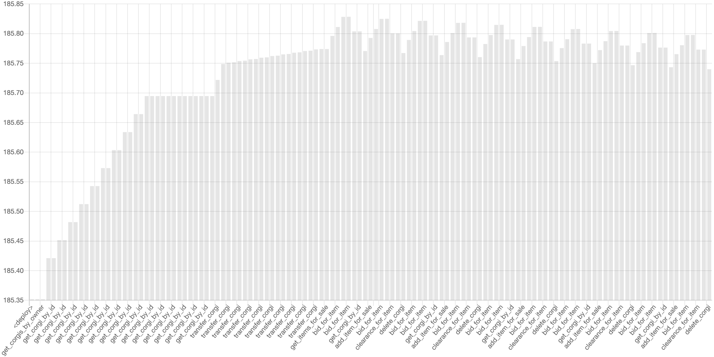

# Corgis contract

## Interacting with Corgis contract

The Corgis contract is located in the `contract` folder.
It is written in Rust.
Here is an overview on how to develop NEAR contracts using Rust:

<https://docs.near.org/docs/develop/contracts/rust/intro>

## Building

Run the following to build the Corgis contract:

```sh
cargo build --target wasm32-unknown-unknown --release
```

The contract is compiled down to a WASM binary.
You can find this binary in
`target/wasm32-unknown-unknown/release/corgis_nft.wasm`.

## Contract Configuration

The contract can be configured at build time.
The respective config file is [config.json](config.json).
These are the configuration fields:

- `page_limit`: How many corgis are returned at most by `get_global_corgis`?
- `mint_fee`: Amount the user needs to pay for creating a corgi.

In addition, the contract provides a [methods.json](methods.json) file.
This file contains the `viewMethods` and `changeMethods` provided by the contract.
It is useful by any client of the contract.

## Deploying our Corgis contract

To deploy our contract, we need `near-cli`.
The `near-cli` tool allows us to deploy and interact with contracts on the NEAR Blockchain.

We can deploy our contract with:

```sh
near deploy --wasmFile target/wasm32-unknown-unknown/release/corgis_nft.wasm
```

## Reference

Here is a quick reference on how to interact with our Corgis contract on the NEAR Blockchain.
In the following sections,
`$CONTRACT_NAME` refers to the developer account.
This is the account that creates and deploys the contracts below.
On the other hand, `$ACCOUNT_NAME` refers to the end user account that uses our
Corgi site.

### `create_corgi`

This contract method creates a corgi in the Blockchain.
In order to run the following command,
you must be logged in with the `$ACCOUNT_NAME`.

```sh
near --accountId $ACCOUNT_NAME call $CONTRACT_NAME create_corgi '{"name":"doggy dog","quote":"To err is human — to forgive, canine","color":"green","background_color":"blue"}' --amount 0.1
```

The `amount` is how much the user has to pay to mint the corgi.
Currenly fee is `0.1` NEAR, indicated by `mint_fee` configuration field.

This contract returns newly created `Corgi`.
The `id` field is random number encoded in *base58*.
The `created` and `modified` fields indicates when this corgi was created,
expressed in nanoseconds.
`sender` is updated when this corgi is being transferred.
`for_sale` is `null` when this corgi is not in auction (this is the default),
otherwise will contain information about bidders.

```js
{
  id: 'FAvBsovGS294hmD49pgCa9',
  name: 'doggy dog',
  quote: 'To err is human — to forgive, canine',
  color: 'green',
  background_color: 'blue',
  rate: 'COMMON',
  owner: '$ACCOUNT_NAME',
  created: 1616001893385302300,
  modified: 1616001893385302300,
  sender: '',
  for_sale: null
}
```

The `rate` field has the following type:

```typescript
type Rarity = 'COMMON'
            | 'UNCOMMON'
            | 'RARE'
            | 'VERY_RARE'
```

### `get_corgi_by_id`

Returns the `Corgi` given by `id`.

This is a view method.
Note the parameter is `&self` (without being mutable) in the method definition.
This means it doesn't modify state.
In the frontend (`/src/index.js`) this is added to the `"viewMethods"` array.

```sh
near view $CONTRACT_NAME get_corgi_by_id '{"id": "<corgi-id>"}'
```

The response returns the specified `Corgi`.
See `create_corgi` method for details.

### `get_corgis_by_owner`

```sh
near view $CONTRACT_NAME get_corgis_by_owner "{\"owner\":\"$ACCOUNT_NAME\"}"
```

Note that in this example we use double-quotes to be able to expand the shell variable `$ACCOUNT_NAME`.

The response returns an array of corgis, as returned by `create_corgi` method.

### `delete_corgi`

Deletes a `Corgi` by the given `id`.

```sh
near --accountId $ACCOUNT_NAME call $CONTRACT_NAME delete_corgi '{"id": "<corgi-id>"}'
```

### `transfer_corgi`

Transfer the Corgi with the given `id` to `receiver`.
Only the `owner` of the corgi can make such a transfer.

```sh
near --accountId $ACCOUNT_NAME call $CONTRACT_NAME transfer_corgi '{"receiver": "new-onwer.testnet", "id": "<corgi-id>"}'
```

### `get_global_corgis`

This command returns all corgis that have been created,
limited to `page_limit` corgis.

```sh
near view $CONTRACT_NAME get_global_corgis
```

The response returns an array of corgis, as returned by `create_corgi` method.

### `add_item_for_sale`

Puts the given `Corgi` for sale.
The `duration` indicates for how long the auction should last, in seconds.

```sh
near --accountId $ACCOUNT_NAME call $CONTRACT_NAME add_item_for_sale '{"token_id": "<corgi-id>", "duration": 3600}'
```

In the example above, the duration `3600` indicates the auction will last one hour.

### `get_items_for_sale`

Returns all `Corgi`s currently for sale.
That is, all `Corgi`s which are in auction.

```sh
near view $CONTRACT_NAME get_items_for_sale
```

The response returns an array of corgis, as returned by `create_corgi` method.
In addition, each corgi is augmented with the auction information.
This is indicated in the `for_sale` field.
It contains the list of bidders and the expiration timestamp,
expressed in nanoseconds.

```js
{
  // Rest of Corgi's fields
  for_sale: {
    bids: [
      {
        bidder: 'test-1616001731174.testnet',
        amount: '50000000000000000000000000',
        timestamp: '1616001924398792533'
      },
      {
        bidder: 'test-1616001726275.testnet',
        amount: '20000000000000000000000000',
        timestamp: '1616001919499740335'
      }
    ],
    expires: '1616001930836106961'
  }
}
```


### `bid_for_item`

Makes a bid for a `Corgi` already in auction.
This is a `payable` method, meaning the contract will escrow the `attached_deposit` until the auction ends.

```sh
near --accountId $ACCOUNT_NAME call $CONTRACT_NAME bid_for_item '{"token_id": "<corgi-id>"}' --amount 0.2
```

The amount indicate how much is the user willing to pay for the `Corgi`,
expressed in NEARs.

### `clearance_for_item`

Makes a clearance for the given `Corgi`.
Only the corgi `owner` or the highest bidder can end an auction after it expires.
All other bidders can get their money back when calling this method.

```sh
near --accountId $ACCOUNT_NAME call $CONTRACT_NAME clearance_for_item '{"token_id": "<corgi-id>"}'
```

## Contract Profiler

The following chart shows the storage cost for a sample workload.
Explore the script [../test/measure.mjs](../test/measure.mjs) to check out the workload used.



## Development & Tooling

For Rust development with Visual Studio Code,
you may want to check out the _rust.analyzer_ extension

> <https://rust-analyzer.github.io/>
